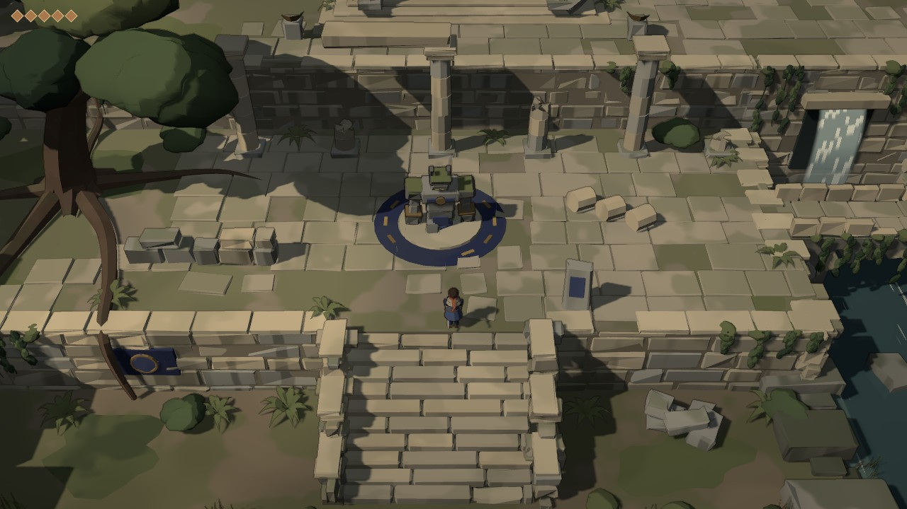

# bell_muted_cel3d_01 — full-3D muted cel-shaded Bell (visual hypothesis test)

A standalone Three.js prototype. It asks one question: **could Bell work as a fully 3D
action-adventure with restrained cel/toon shading** instead of pixel sprites or a 2D/3D hybrid?
It is one compact playable area, an overgrown sanctuary courtyard above a small ravine, which
takes about 1–3 minutes to explore. It is not a vertical slice.

It is isolated from every other experiment in the repo. Nothing outside this folder was changed.



## Run

You don't need to install or build anything. three.js r170 is vendored in `vendor/`.

```sh
cd experiments/bell_muted_cel3d_01
npm start                  # npx http-server -p 8090 -c-1 .
# open http://localhost:8090
```

`python3 -m http.server 8090` works too. Opening `index.html` straight from disk does not work,
because ES modules have to be served over http.

URL parameters: `?x=..&z=..` sets the spawn point. `?pitch=42&dist=30&fov=34&yaw=0` sets the
camera. `?nohelp` hides the help box. `?capture` stops the rAF loop so the tools can render
frames on demand.

## Controls

| Key | Action |
| --- | --- |
| WASD / arrows | move |
| Space | jump |
| J / X / left click | strike |
| Shift / K | dash |
| T | toon ramp ↔ plain Lambert (unquantised) |
| O | edge lines + character hulls on/off |
| P | shadows on/off |
| G | grade (desat / split tone / vignette) on/off |
| C | broad shade zones on/off |
| 1 2 3 4 | camera pitch 35° / 42° / 50° / 58° |
| [ ] | camera distance |
| - = | FOV |
| R | reset (player + guardian) |
| H | hide help |

## The route

1. Start on the south bank, by a ruined gate.
2. Wade the stream, or use the stepping stones.
3. Climb the 10-step main staircase to the courtyard (+3 m). The big tree is here, along with
   the broken colonnade and a stone guardian kneeling on an indigo ring.
4. Cross the bridge over the gorge. The south parapet is broken, so you can fall into the gorge.
   The gorge itself is walkable: a waterfall falls from a culvert and you can wade under the arch.
5. Cross the promontory, past a fallen colossal head, and climb the stair to the terrace (+6 m).
6. Reach the sealed shrine. Its bronze seal glows brighter as you approach. You can see the shrine
   from the courtyard well before you get there.

## Screenshots (`docs/screenshots/`)

| File | What |
| --- | --- |
| 01-hero-stair-courtyard | **strongest**: stair, retaining wall, courtyard, guardian, colonnade, tree, culvert |
| 02-start-south-bank | **weakest**: start area, flat ground, straight stream |
| 03-courtyard-tree | big tree, roots, ruined enclosure |
| 04-combat-windup | strike arc vs the guardian |
| 05-bridge-gorge, 06-gorge-wading | elevated route and the space under it |
| 07-shrine-destination | the sealed shrine |
| 08-promontory-head | promontory stair, fallen head (weak object), sky gap at the top right |
| 09/10/11 | the same frame with toon off / edges off / shadows off |
| 12/13 | pitch 58° / 35° |
| 14-value-check-grayscale | shot 01 in grayscale |
| m1_* … m4_* | milestone history (first frame → current) |

To regenerate the set: `npx http-server -p 8123 -c-1 . &` then
`NODE_PATH=$(npm root -g) node tools/capture.mjs`.

## Renderer summary

- **Shading.** `MeshToonMaterial` with a 64-px, 3-band ramp: shadow 0 / mid 0.42 / lit 1.0, with
  slightly soft steps. A cool hemisphere fill keeps the shadows from going black. One warm
  directional light comes from the upper left (west-south-west, about 35° elevation). It casts
  PCF-soft shadows that follow the camera.
- **Painted surface** (`materials.js › patchPaintShader`). This is injected into `color_fragment`
  and adds:
  - world-space fbm, posterised into 2–3 soft tonal regions (painted variation, not texture noise)
  - vertical damp streaks on walls
  - moss on up-facing surfaces
  - a height falloff toward a cool low tint, so the ravine reads damper and deeper
  - broad low-frequency shade zones, for an authored value composition
  - per-block vertex-colour tints
  - no textures at all
- **Outlines.** One composite pass draws depth edges: a silhouette step plus a depth-Laplacian
  crease. The edge colour multiplies the underlying colour (tinted, never black) and fades with
  distance. Characters also get an inverted hull built from a smooth-normal copy, about 2.2 cm
  thick. The guardian's hull is 1.25× that. Environment edges are deliberately weaker than the
  character silhouettes.
- **Materials.** There is no specular term anywhere and no normal maps. Material identity comes
  from palette, geometry and the paint parameters: limestone, cool stone, soil, moss, foliage,
  bark, water, cloth and bronze each have their own.
- **Geometry.** Architecture is built from chamfered blocks (`geom.js › chamferBox`) with small
  jitter and rare chips. Masonry is laid in courses with damp lower courses and a light coping
  lip that marks walkable edges. Paving loses slabs in noise-clustered patches. Cliffs are
  stacked limestone strata. Foliage masses are noise-lobed blobs with spherical normals, so the
  toon bands describe the whole mass rather than its facets.
- **Water.** Toon-lit, so it receives the cast shadows. A per-vertex depth drives painted
  shallow/deep bands, a wobbling shoreline band and sparse drifting highlight dashes. The
  waterfall is a streaked sheet with splash rings. There are no reflections.
- **Performance.** About 70–125 draw calls (geometry is batched per material) and about 250k
  triangles. I only measured with headless SwiftShader, so I have no real-GPU fps. A scene this
  size should be trivial for any discrete or integrated GPU.

## Candid visual assessment

**What works**
- The camera and layout read as an action-adventure, not a platformer. Heights, stairs, drops
  and walkable edges are immediately legible. The light coping lip on wall tops and the mid-band
  wall faces do most of that work.
- The palette stays muted and hierarchical. The scarf, the bronze and the indigo are the only
  accents, and the grayscale check (shot 14) holds up.
- The monumental shrine, the culvert waterfall and the wade under the bridge produce real moments
  of age and mystery.
- The player, the guardian and the architecture clearly share one rendering language.

**What doesn't (yet)**
- Too often the image still reads as **clean low-poly indie 3D** rather than *illustrated*. The
  comparison shots show that toon vs Lambert is only a subtle difference on this mostly planar
  geometry. Most of the "illustrated" feel comes from geometry, palette and the painted value
  zones, not from the cel shader.
- Edges are restrained, as intended. That also means they add little. Turning them up quickly
  looks cheap.
- The foliage is better than spheres but still blobby. The start area and the stream are flat and
  canal-like. The fallen head and the guardian read as blocky, slightly robotic toys at close
  range.
- The lighting is believable but mostly "clear afternoon". The melancholy has to come from
  composition and colour, because the light isn't doing it.

**Compatible with Bell:** camera grammar, elevation readability, muted ancient palette, carved
indigo/bronze sanctuary language, the scarf as the single warm accent, and a guardian that
matches the architecture.

**Too generic / modern:** uniform flat-lit tops, chamfered-box uniformity, blob foliage, and
perfectly straight water edges.

**Worth recreating in Godot?** Partly. The full-3D route is clearly viable for readability and
gameplay, which is the half a sprite approach can't give you. The illustrated half needs work
that a shader toggle won't provide:
- authored textures or hand-painted vertex colour
- bespoke modelled props (not procedural boxes)
- painted foliage cards around the masses
- stronger, art-directed lighting

That work is a question of art production rather than technology. Recreate this camera and
shading model in Godot, but only alongside a small test of hand-modelled assets. Don't port this
procedural geometry wholesale.

See `docs/RESUME_MUTED_CEL3D.md` for the full handoff.
